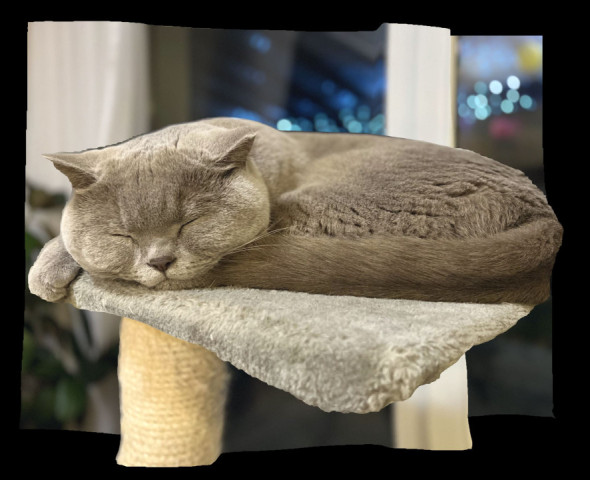
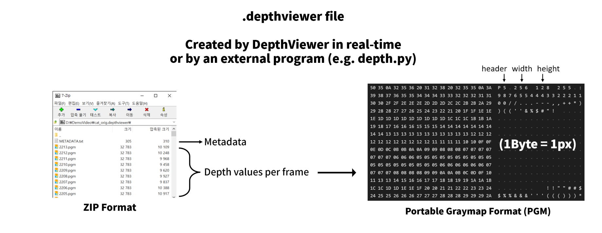

# DepthViewer
 \
Using [MiDaS Machine Learning Model](https://github.com/isl-org/MiDaS), renders 2D videos/images into 3D object with Unity for VR.

## Try Now
- [Releases](https://github.com/parkchamchi/DepthViewer/releases)
- [Steam Page](https://store.steampowered.com/app/2218510/DepthViewer/)

### Outdated builds (less effective 3D)
- [WebGL Demo](https://parkchamchi.github.io/DepthViewer/) ([WebXR version](https://parkchamchi.github.io/DepthViewer/vr_version/))
- [Play Store (For Cardboards)](https://play.google.com/store/apps/details?id=com.parkchamchi.DepthViewer)

## Examples

| Original input (resized) | Plotted (MiDaS v2.1) | Projected | Src |
| --- | --- | --- | --- |
|  |  |  | [#](https://commons.wikimedia.org/wiki/File:Cat_on_a_cat_tree.webp)

## So what is this program?
This program is essentially a depthmap plotter with an integrated depthmap inferer, with VR support.<br>
<br>
<br>
<br>

The depthmaps can be cached to a file so that it can be loaded later.
<br>
<br>
<br>

## Inputs
- Right mouse key: hides the UI.
- WASD: rotate the mesh.
- Backtick `: opens the console.
- Numpad 4/5/6: pause/skip the video.

## Models
The built-in model is [MiDaS v2.1 small model](https://github.com/isl-org/MiDaS/releases/tag/v2_1), which is ideal for real-time rendering.

### Loading ONNX models

#### Tested onnx files:
- [MiDaS v2.1 384 (`model-f6b98070.onnx`)](https://github.com/isl-org/MiDaS/releases/tag/v2_1)
- [MiDaS v3 models (unofficial)](https://github.com/parkchamchi/MiDaS/releases/tag/22.12.07)
- [MiDaS v3.1 models (unofficial)](https://github.com/parkchamchi/MiDaS/releases/tag/23.02.18)

From my experience `dpt_hybrid_384` seems to be more robust against drawn images (i.e. non-photos)

- Put the onnx files under the `onnx` directory.
- Open this options menu and select the file and click the `Load` button

#### OnnxRuntime GPU execution providers
- [CUDA](https://onnxruntime.ai/docs/execution-providers/CUDA-ExecutionProvider.html): Also requires cuDNN. Test version: CUDA `v11.7` and cuDNN `v8.2.4`
- For others, see [here](https://github.com/parkchamchi/DepthViewer/issues/1)

## Recording 360 VR video
If you select a depthfile and an according image/video, a sequence of .jpg file will be generated in `Application.persistentDataPath`. \
Go to the directory, and execute
```xml
ffmpeg -framerate <FRAMERATE> -i %d.jpg <output.mp4>
```
Where `<FRAMERATE>` is the original FPS. 

To add audio,
```xml
ffmpeg -i <source.mp4> -i <output.mp4> -c copy -map 1:v:0 -map 0:a:0 -shortest <output_w_audio.mp4>
```

## Connecting to an image server
The server has to provide a `jpg` or `png` bytestring when requested. 
Like [this program](https://github.com/parkchamchi/screencaptureserver): it captures the screen and returns the jpg file.
I found it to be faster than the built-in one (20fps for 1080p video).
<br>
Open the console with the backtick ` key and execute (url is for the project above, targeting the second monitor)
```
httpinput localhost:5000/screencaptureserver/jpg?monitor_num=2
```

## Importing/Exporting parameters for the mesh
After loading an image or a video while the `Save the output` toggle is on, enter the console command
```
e
```
This saves the current parameters (`Scale`, ...) into the depthfile so that it can be used later.

## Using ZeroMQ + Python + PyTorch/OnnxRuntime
May be unstable.
Implemented after `v0.8.11-beta.1`.
1. Run [`DEPTH/depthpy/depthmq.py`](DEPTH/depthpy/depthmq.py). (Also see [here](./DEPTH/depthpy/README.md) for its dependencies, plus `pyzmq` is required)
2. In the DepthViewer program, open the console and type `zmq 5555`.

Use `python depthmq.py -h` for more options such as port (default: `5555`), model (default: `dpt_hybrid_384`)
To use OnnxRuntime instead of PyTorch, add `--runner ort` and `--ort_ep cuda` or `--ort_ep dml`. For this `onnxruntime-gpu` or `onnxruntime-directml` is needed, respectively.

## Using ZeroMQ + Python + FFmpeg + PyTorch/OnnxRuntime
Gone are the days of VP9 errors and slow GIF decoding.
Implemented after `v0.8.11-beta.2`.
1. Run [`DEPTH/depthpy/ffpymq.py`](DEPTH/depthpy/ffpymq.py). Also add `--optimize` for the float16 optimazation.
2. In the DepthViewer program, open the console and type `zmq_id 5556`. Now all video/GIF inputs are passed to the server and fetches the image and the depth. Use `zmq_id -1` to disconnect.

## Tested formats:
### Images
- .jpg
- .png

### Videos
- .mp4, ... : 
Some files can't be played because Unity's VideoPlayer can't open them. (e.g. VP9) 

### Others
- .gif : Certain formats are not supported.
- .pgm : Can be used as a depthmap (Needs a subsequential image input)
- .depthviewer

## Notes
- If VR HMD is detected, it will open with OpenXR.
- All outputs will be cached to `Application.persistentDataPath` (In Windows, `...\AppData\LocalLow\parkchamchi\DepthViewer`).
- Depth files this program creates are of extention `.depthviewer`, which is a zip file with .pgm files and a metadata file.
- To create `.depthviewer` files using python, see [here](./DEPTH/depthpy/README.md)
- Rendering the desktop is only supported in Windows for now.
- C# scripts are in [DEPTH/Assets/Scripts](DEPTH/Assets/Scripts).
- Python scripts are in [DEPTH/depthpy](DEPTH/depthpy).
- [Also see here](./DOC.md)

## Todo
- Overhaul UI & Control
- Add more options
- Fix codecs
- Stablize
### WIP
- VR controllers support [(See here)](https://github.com/parkchamchi/UnityVRControllerTest)
- Support for the servers that send both the image file and the depthmap

## Building
The Unity Editor version used: `2021.3.10f1`

### ONNX Runtime dll files
- These are added to the repo with Git LFS since `v0.8.9`

These dll files have to be in [`DEPTH/Assets/Plugins/OnnxRuntimeDlls/win-x64`](DEPTH/Assets/Plugins/OnnxRuntimeDlls/win-x64).
They are in the nuget package files (.nupkg), get them from <br>
<br>
[Microsoft.ML.OnnxRuntime.Gpu](https://www.nuget.org/packages/Microsoft.ML.OnnxRuntime.Gpu/) => `microsoft.ml.onnxruntime.gpu.1.13.1.nupkg/runtimes/win-x64/native/*.dll` <br>
- `onnxruntime.dll`
- `onnxruntime_providers_shared.dll`
- `onnxruntime_providers_cuda.dll`
- I don't think this is needed: `onnxruntime_providers_tensorrt.dll`

[Microsoft.ML.OnnxRuntime.Managed](https://www.nuget.org/packages/Microsoft.ML.OnnxRuntime.Managed/) => `microsoft.ml.onnxruntime.managed.1.13.1.nupkg/lib/netstandard1.1/*.dll` <br>
- `Microsoft.ML.OnnxRuntime.dll`

## Misc

### Libraries used

- [MiDaS](https://github.com/isl-org/MiDaS) (MIT License)
```
@article {Ranftl2022,
    author  = "Ren\'{e} Ranftl and Katrin Lasinger and David Hafner and Konrad Schindler and Vladlen Koltun",
    title   = "Towards Robust Monocular Depth Estimation: Mixing Datasets for Zero-Shot Cross-Dataset Transfer",
    journal = "IEEE Transactions on Pattern Analysis and Machine Intelligence",
    year    = "2022",
    volume  = "44",
    number  = "3"
}
```
```
@article{Ranftl2021,
	author    = {Ren\'{e} Ranftl and Alexey Bochkovskiy and Vladlen Koltun},
	title     = {Vision Transformers for Dense Prediction},
	journal   = {ICCV},
	year      = {2021},
}
```

- [monocular-depth-unity](https://github.com/GeorgeAdamon/monocular-depth-unity) (MIT License)
- [Unity Standalone File Browser](https://github.com/gkngkc/UnityStandaloneFileBrowser) (MIT License)
- [Unity Simple File Browser](https://github.com/yasirkula/UnitySimpleFileBrowser) (MIT License)
- [WebXR Export](https://github.com/De-Panther/unity-webxr-export) (Apache License 2.0)
- [Google Cardboard XR Plugin for Unity](https://github.com/googlevr/cardboard-xr-plugin) (Apache License 2.0)
- [UniGif](https://github.com/WestHillApps/UniGif) (MIT License)
- [ONNX Runtime](https://github.com/microsoft/onnxruntime) (MIT License)
- [In-game Debug Console for Unity 3D](https://github.com/yasirkula/UnityIngameDebugConsole) (MIT License)
- [Pcx - Point Cloud Importer/Renderer for Unity](https://github.com/keijiro/Pcx) (The Unlicense)
- [GaussianBlur](https://github.com/keijiro/GaussianBlur) (MIT License)
- [NetMQ](https://github.com/zeromq/netmq) (LGPL)
- [AsyncIO](https://github.com/somdoron/AsyncIO) (MPL 2.0)
- [NaCl.net](https://github.com/somdoron/NaCl.net) (MPL 2.0)

- [ZoeDepth](https://github.com/isl-org/ZoeDepth) (MIT License) *For Python scripts only*
- [Marigold](https://github.com/prs-eth/Marigold) (Apache License 2.0) *For Python scripts only*
```
@misc{https://doi.org/10.48550/arxiv.2302.12288,
  doi = {10.48550/ARXIV.2302.12288},
  
  url = {https://arxiv.org/abs/2302.12288},
  
  author = {Bhat, Shariq Farooq and Birkl, Reiner and Wofk, Diana and Wonka, Peter and Müller, Matthias},
  
  keywords = {Computer Vision and Pattern Recognition (cs.CV), FOS: Computer and information sciences, FOS: Computer and information sciences},
  
  title = {ZoeDepth: Zero-shot Transfer by Combining Relative and Metric Depth},
  
  publisher = {arXiv},
  
  year = {2023},
  
  copyright = {arXiv.org perpetual, non-exclusive license}
}
```

- Font used: [Noto Sans KR](https://fonts.google.com/noto/specimen/Noto+Sans+KR) (SIL Open Font License)
- [Readme file](DEPTH/Assets/Assets/README.txt)

### Also check out
- This project was inspired by [VRin](https://www.vrin.app/)
- [godot-midas-depth](https://github.com/lewiji/godot-midas-depth)

## Remarks

### 2023 March 9

This project was started in September 2022 with primary goal of using monocualar depth estimation ML model for VR headsets.
I could not find any existing programs that fit this need, except for a closed-source program *VRin* (link above).
That program (then and still in `Alpha 0.2`) was the main inspiration for this project, but I needed more features like image inputs, other models, etc.
As it was closed source, I grabbed a [Unity/C# book](https://www.amazon.com/Learning-Developing-Games-Unity-2021/dp/1801813949) and started to generate a mesh from script.

I gradually added features by trial-and-error rather than through planned development, which made the code a bit messy, and many parts of this program could have been better.
But after a series of progressions, I found the [v0.8.7](https://github.com/parkchamchi/DepthViewer/releases/tag/v0.8.7-beta) build to be *okay enough* for my personal use.
So this project is on "indefinite hiatus" from now on, but I'm still open for minor feature requests and bug fixes.

I thank all people who gave me compliments, advices, bug reports, and criticisms.

Thank you.

Chanjin Park
parkchamchi@gmail.com

### 2023 March 21

I'll be still updating this project, it can be slow since the school has started again.